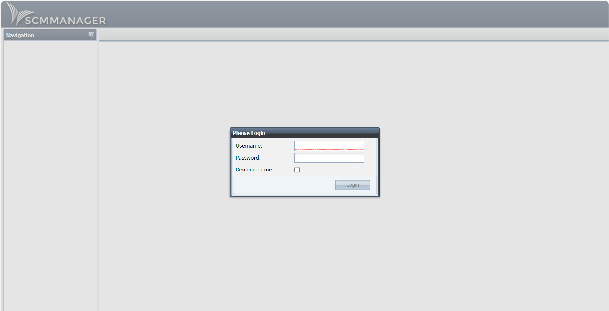
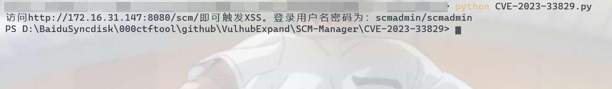
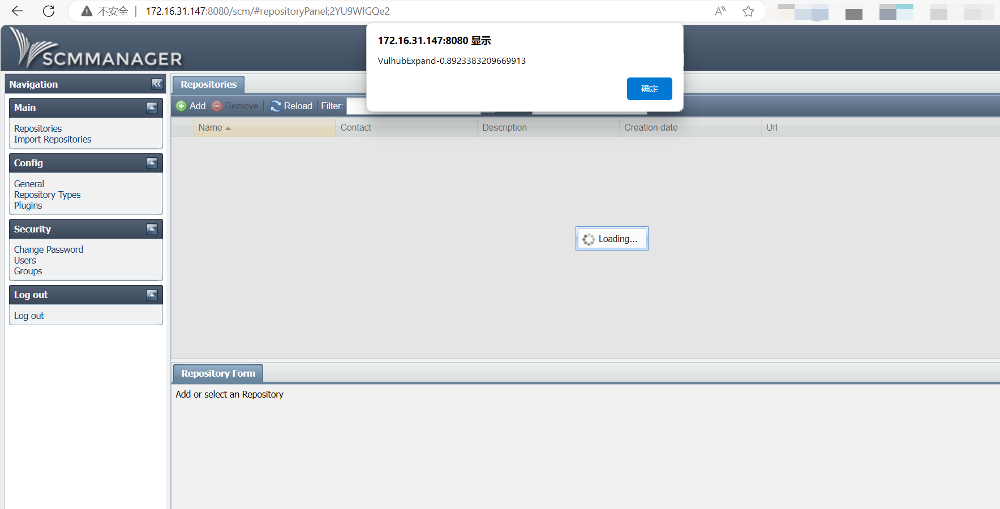

# SCM Manager XSS漏洞（CVE-2023-33829）

SCM-Manager 是一款开源的版本库管理软件，同时支持 subversion、mercurial、git 的版本库管理。安装简单，功能较强，提供用户、用户组的权限管理 ，有丰富的插件支持。由于在MIT的许可下是开源的，因此它允许被用于商业用途，而且其代码可以在GitHub上获取到。

## 测试环境（目前仅支持AMD64，不支持ARM）

执行如下命令启动一个SCM-Manager 1.60：

```
docker compose up -d
```

环境运行后，访问`http://your-ip:8080`即可查看SCM-Manager主页，默认账密`scmadmin/scmadmin`



## 漏洞复现

修改脚本中IP：


运行脚本：

```
python CVE-2023-33829.py
```



登录输入用户名密码触发XSS：

