# Zabbix zbx_auditlog_global_script 远程命令执行漏洞（CVE-2024-22120）复现及漏洞环境

漏洞存在于audit.c的zbx_auditlog_global_script函数中，由于clientip字段未经清理，可能导致SQL时间盲注攻击，经过低权限用户身份验证的威胁者可利用该漏洞从数据库中获取敏感信息，并可能导致将权限提升为管理员或导致远程代码执行。

**影响版本：**

- 6.0.0 至 6.0.27
- 6.4.0 至 6.4.12
- 7.0.0alpha1

## 测试环境

执行如下命令启动一个Zabbix漏洞环境：

```
docker compose up -d
```

访问 http://127.0.0.1:8080 发现存在Zabbix端Web界面 

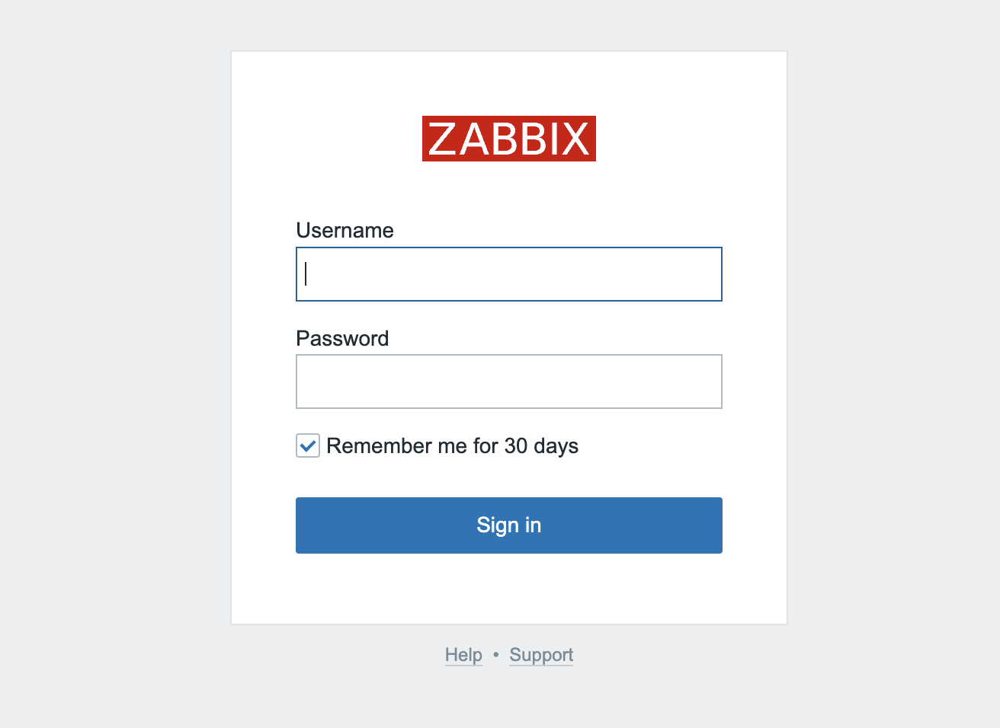

使用Admin/zabbix登录，然后按照图示顺序打开Hosts的配置

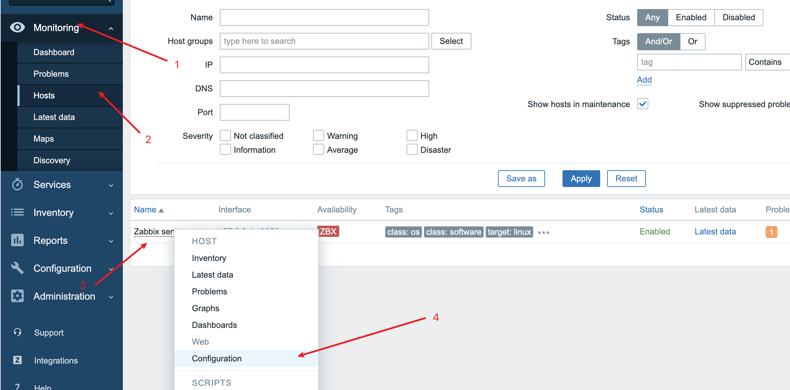

修改Host name为“host-01”；Agent为“172.20.240.6”

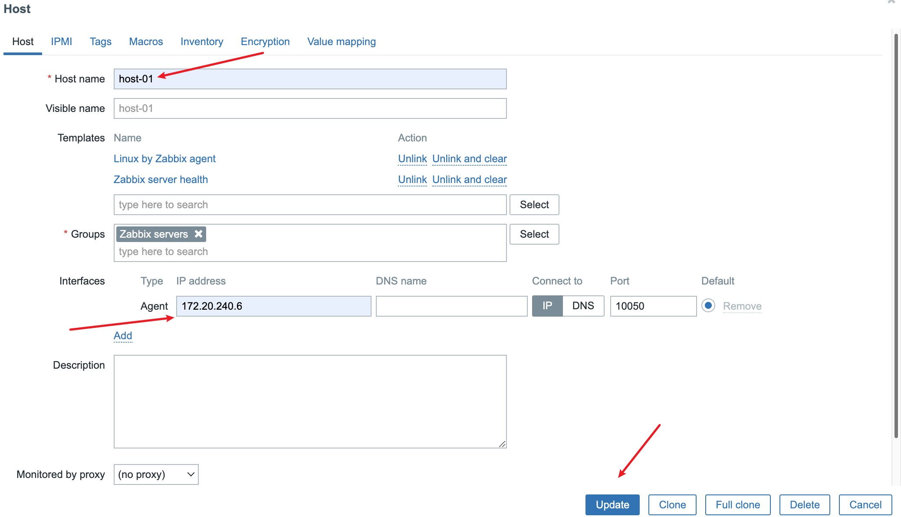

稍等一段时间，发现zabbix处于正常状态

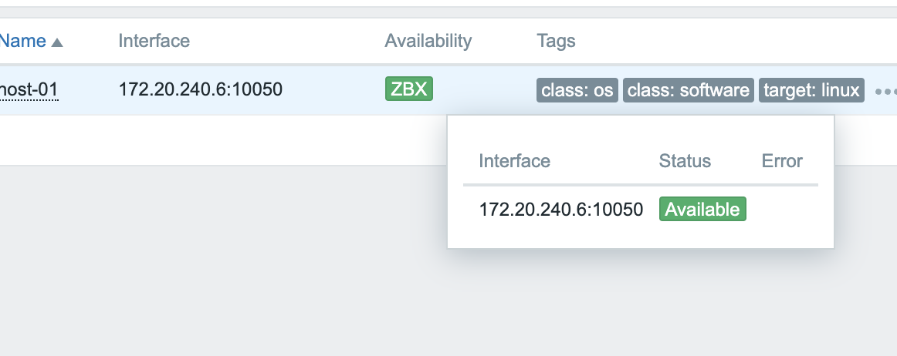

"Administration"-->"User groups"-->"Guests"-->"Permissions"-->"Select"，选择"Zabbix servers"的Read权限并更新。

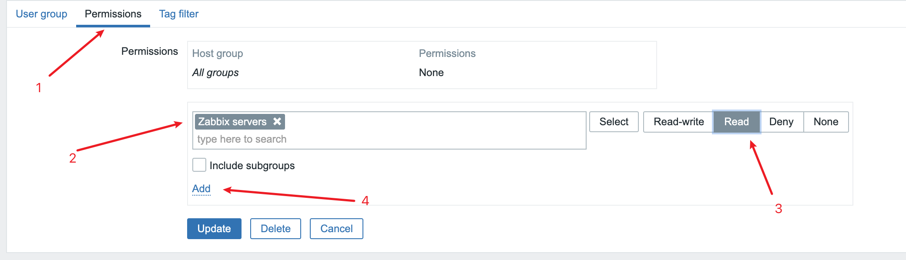

此时创建一个test1用户，密码为Test@123，Groups为Guests，Role为User role

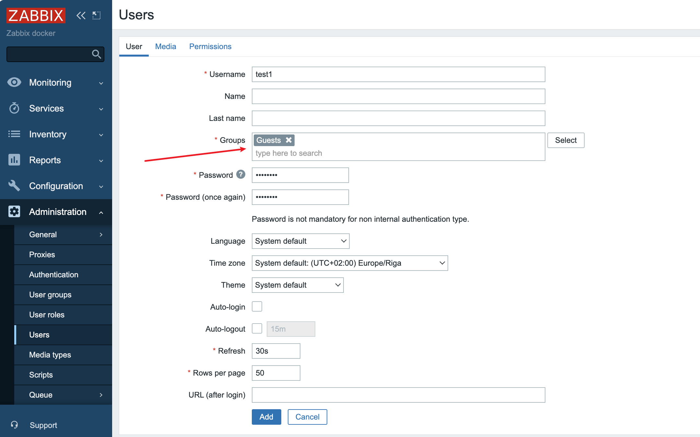

此时注意！不要将admin的账号logout！这样会更新其sessionid，导致漏洞无法被利用。

## 漏洞复现

漏洞利用条件：需要有一个低权限的账号，该账号有执行脚本的权限（即刚才创建的test1账号）。且admin的session还在有效期。

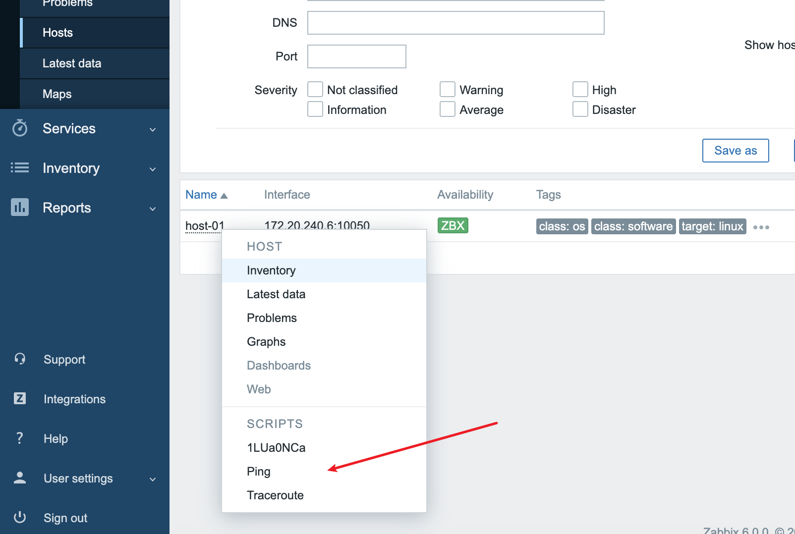

使用之前创建的test1/Test@123账号登录低权限用户，使用burpsuite抓包获取一下信息。

hostid在响应包中

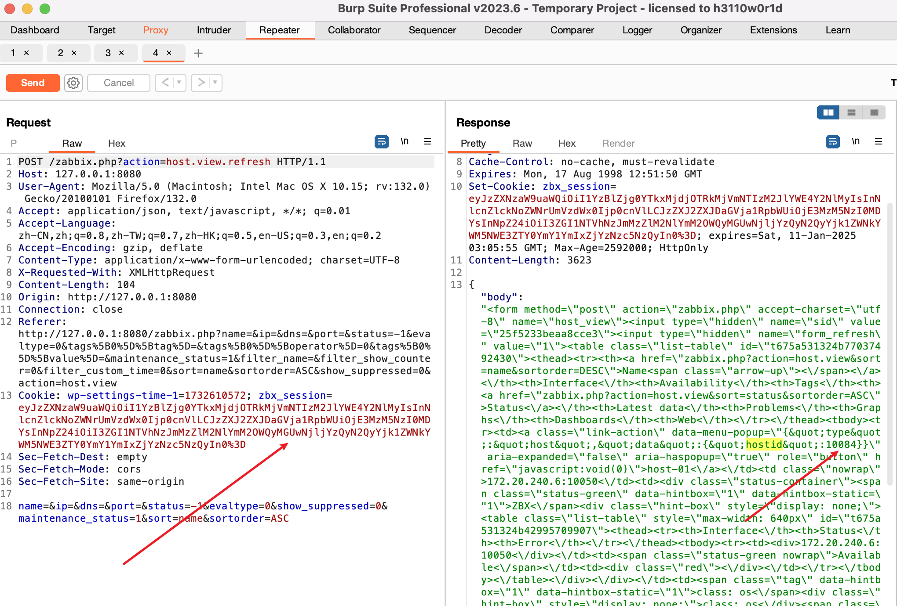

zbx_session使用base64解密后得到对应的sessionid

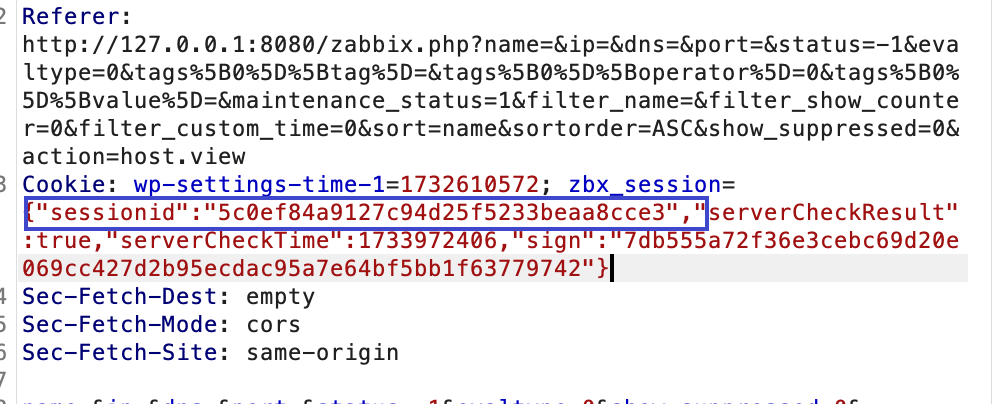

获取到所需信息之后执行利用脚本，执行之后会开启时间盲注，一段时间后获取到shell，至此漏洞利用成功。

```
python -m pip install requests pwntools
python CVE-2024-22120-RCE.py --ip 127.0.0.1 --sid 5c0ef84a9127c94d25f5233beaa8cce3 --hostid 10084
```

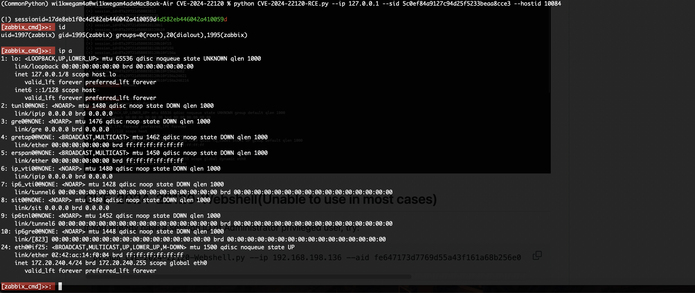

## 复现问题

遇到如下问题代表admin的session已经过期，需要重新登录admin账户更新session

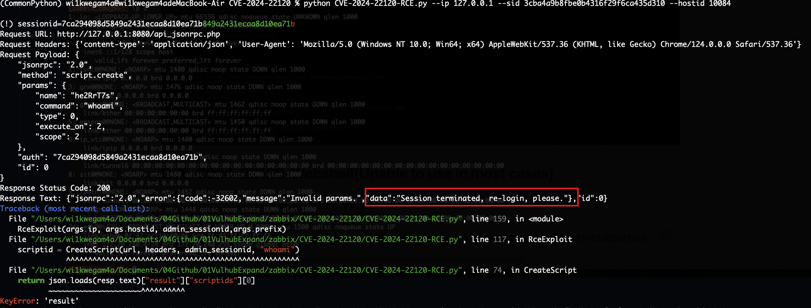
