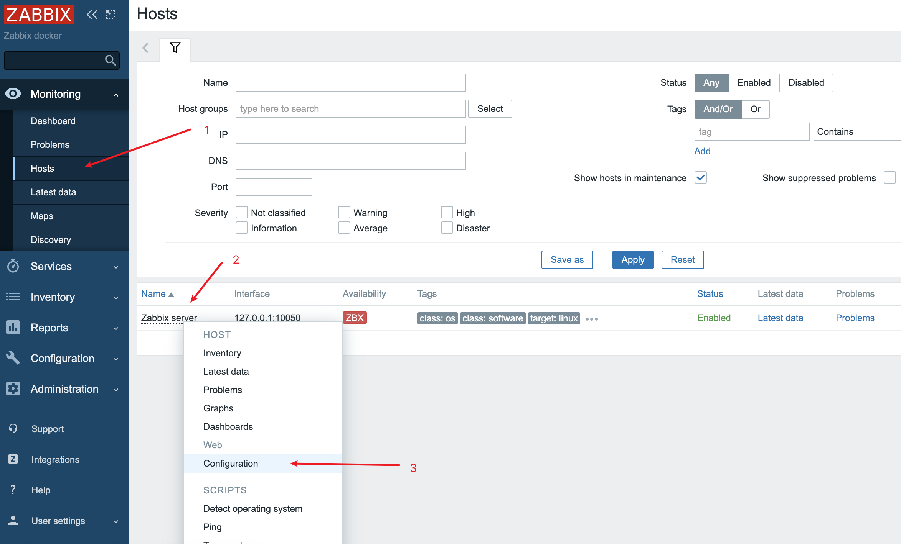
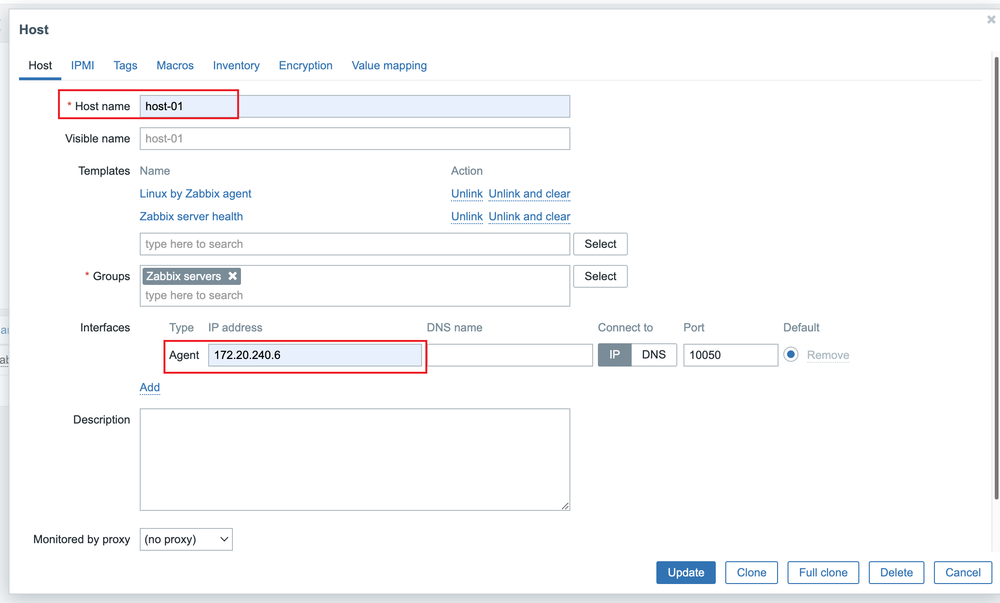
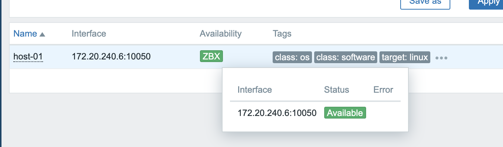
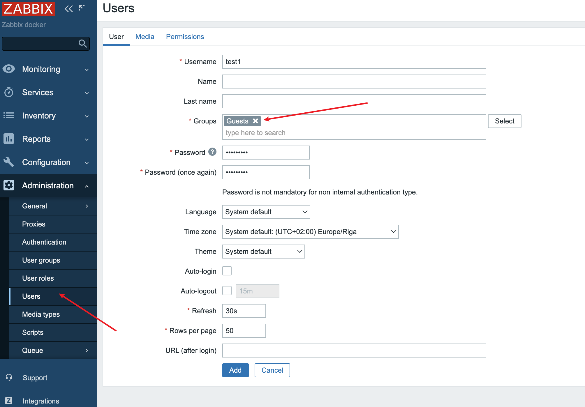
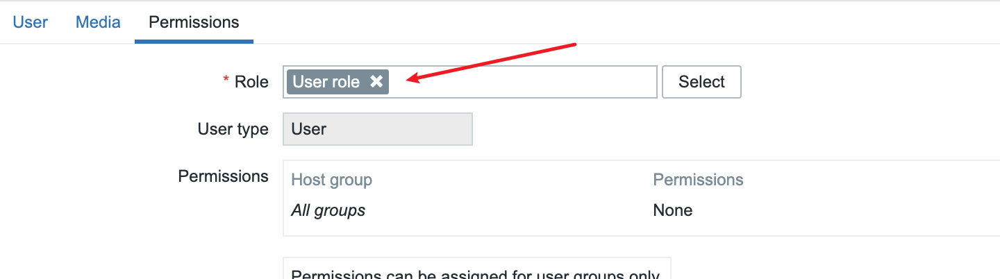

# Zabbix addRelatedObjects 函数后台SQL注入漏洞（CVE-2024-42327）

Zabbix web端上的非管理员用户账户，具有默认的“User Role”或任何其他赋予 API 访问权限的角色，均可利用此漏洞。CUser 类中的 `addRelatedObjects` 函数存在 SQL 注入漏洞，该函数由 `CUser.get` 函数调用，而 `CUser.get` 函数对所有具有 API 访问权限的用户开放。

**影响版本：**

- 6.0.0 至 6.0.31
- 6.4.0 至 6.4.16 
- 7.0.0

## 测试环境

执行如下命令启动一个Zabbix漏洞环境：

```
docker compose up -d
```

访问 http://127.0.0.1:8080 发现存在Zabbix端Web界面


使用Admin/zabbix登录，然后按照图示顺序打开Hosts的配置



修改Host name为“host-01”；Agent为“172.20.240.6”



稍等一段时间，发现zabbix处于正常状态



到Users中添加一个test1用户，Groups设置为Guests



Role设置为User role



再使用同样的方法设置test2、adminTest（adminTest的Groups多加一个Zabbix administrators）


## 漏洞复现

使用cve-2024-42327.py脚本进行利用，可利用SQL注入获取Guests组内全部用户（哪怕该用户也在Zabbix administrators组内）的加盐密码，后续可以使用John等工具进行Hash爆破。

```
python cve-2024-42327.py -u <API> -n <Username> -p <Pass>
```


